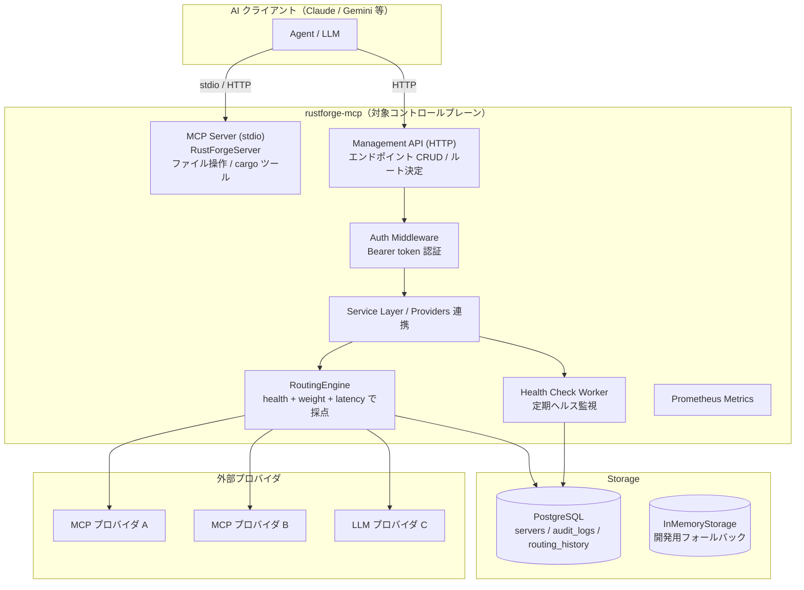

# 完成図（プロジェクトビジョン）

このドキュメントでは、rustforge-mcp が最終的に目指す姿（完成図）を示します。
設計の詳細な意図は [ARCHITECTURE.md](./ARCHITECTURE.md)、現状の実装内容は [IMPLEMENTATION.md](./IMPLEMENTATION.md) を参照してください。

---

## 1. プロジェクトの最終的な目的

rustforge-mcp は **「AI エージェントが、複数の MCP / LLM プロバイダを透過的に利用できる統合ゲートウェイ（コントロールプレーン）」** を目指します。

二つの側面を持つのがこのプロジェクトの特徴です。

1. **Rust 開発用 MCP サーバ**
   - AI モデル（Claude / Gemini など）が Rust プロジェクトのファイル操作・cargo コマンド実行を直接行えるツール群を提供する。

2. **MCP / LLM スイッチング基盤（コントロールプレーン）**
   - 登録された複数の MCP / LLM エンドポイントに対し、ヘルス状態・重み・レイテンシを考慮したスコアリングで「どのエンドポイントへルーティングするか」を動的に決定する。
   - HTTP 管理 API によるエンドポイントの登録・取得・削除、およびメトリクス公開・監査ログ・ルーティング履歴を提供する。

つまり、**「Rust 開発を支援するツール層」と「外部 AI プロバイダを束ねるルーティング層」** を兼ね備えた、Rust に特化した AI 統合プラットフォームです。

---

## 2. 完成時の全体構成（対象コンポーネントマップ）

---

## 3. 完成時（Future State）の機能要件

最終形で想定される機能群です（現状は一部のみ実装。実装状況は [IMPLEMENTATION.md](./IMPLEMENTATION.md) 参照）。

### 3.1 MCP ツール層（Rust 開発支援）
- **ファイル管理**: `list_files` / `read_file` / `write_file`（実装済み）
- **cargo 統合**: 生 cargo コマンド、`cargo check` / `test` / `clippy` / `add`（実装済み）
- **実行時・開発時の安全性**:
  - 実装済み: 作業ディレクトリ制限（`WORKSPACE_ROOT` 外へのパスを拒否）
  - 実装済み: 許可リスト（`CARGO_ALLOWED_COMMANDS`: build / check / test / clippy / fmt / add / doc）
  - 実装済み: シェルメタ文字拒否（インジェクション対策）とタイムアウト（`CARGO_TIMEOUT_SECS`）
  - 将来: 並列実行制御、ヒューマンアプルーバル
- **プロジェクト認識**: Cargo.toml 解析、依存関係ツリー、`cargo metadata` の構造化出力

### 3.2 ルーティング / プロバイダ管理
- **エンドポイント CRUD**（実装済み）
- **ダイナミック・アダプティブな採点**:
  - 実装済み: 重み（weight）・ヘルス状態・レイテンシ・エラー率・連続失敗を `score = weight - latency/20 - error_rate*100 - failures*15 - health_penalty` で算出
  - 実装済み: 複数戦略（`score` / `weighted_random` / `round_robin`）とリクエスト単位の選択
  - 実装済み: サーキットブレーカー（`consecutive_failures` 閾値 3）
  - 将来: リクエスト遂行結果（成功/失敗）のフィードバック反映、セマンティックルーティング
- **プロバイダ実通信連携**:
  - 実装済み: LLM（OpenAI 互換 chat completions）、MCP（streamable HTTP）クライアント
  - 将来: MCP stdio/SSE トランスポート、再試行・バックオフ

### 3.3 可観測性・運用
- **ヘルスチェック**（実装済み、60 秒周期）
- **Prometheus メトリクス**（実装済み: routing_requests_total / health_check_failures_total）
- **監査ログ**（実装済み: `GET /audit-logs` で閲覧可能、作成/削除/ルーティング時に自動記録）
- **ルーティング履歴**（実装済み）
- 将来: トレーシング、アラート、ダッシュボード連携

### 3.4 セキュリティ
- **Bearer token 管理 API 認証**（実装済み）
- **RBAC**（実装済み: Admin / Viewer の 2 ロール、読み取り専用トークン `VIEWER_API_TOKEN`）
- **API キーの暗号化保管**（実装済み: `ENCRYPTION_KEY` による AES-256-GCM 保存時暗号化）
- 将来: キーローテーション、鍵管理サービス運用、監査 API のフィルタ/ページング強化

---

## 4. 完成へ向けた進化の方向性

コードベースに明確に残されている「未完成の設計意図」に基づく進化パスです。

| 領域 | 現状 | 将来の方向性 |
| --- | --- | --- |
| Providers 連携 | LLM / MCP クライアント実装済み、ルーティング結果を実際にフォワード | MCP stdio/SSE トランスポート、再試行・バックオフ |
| ルーティング戦略 | 3 戦略（score / weighted_random / round_robin）+ サーキットブレーカー | フィードバック学習、セマンティックルーティング |
| コマンド安全性 | 許可リスト + パス制限 + メタ文字拒否 + タイムアウト | 並列実行制御、ヒューマンアプルーバル |
| Storage | PostgreSQL / InMemory の切り替え可能 | マイグレーション自動化、設定の外部化 |
| 認証・監査 | RBAC（Admin/Viewer）+ API キー暗号化 + 監査ログ API | キーローテーション、監査 API のフィルタ/ページング強化 |
| メトリクス | 2 カウンタ + ヘルスチェック | レイテンシヒストグラム、成功率、エンドポイント別詳細 |

> 重要な設計方向性: `main.rs` のコメント
> > "Since this uses stdin/stdout, it will take over the terminal. In a real control plane, you might want to run this as a client or a different transport."
>
> つまり、**本来の完成形では MCP サーバとコントロールプレーン（管理・ルーティング基盤）が分離され、コントロールプレーンが同期実行ではなく独立したサービスとして稼働する**設計意図が示されています。このコメントは、プロジェクトの将来像を理解する上での重要な手がかりです。
